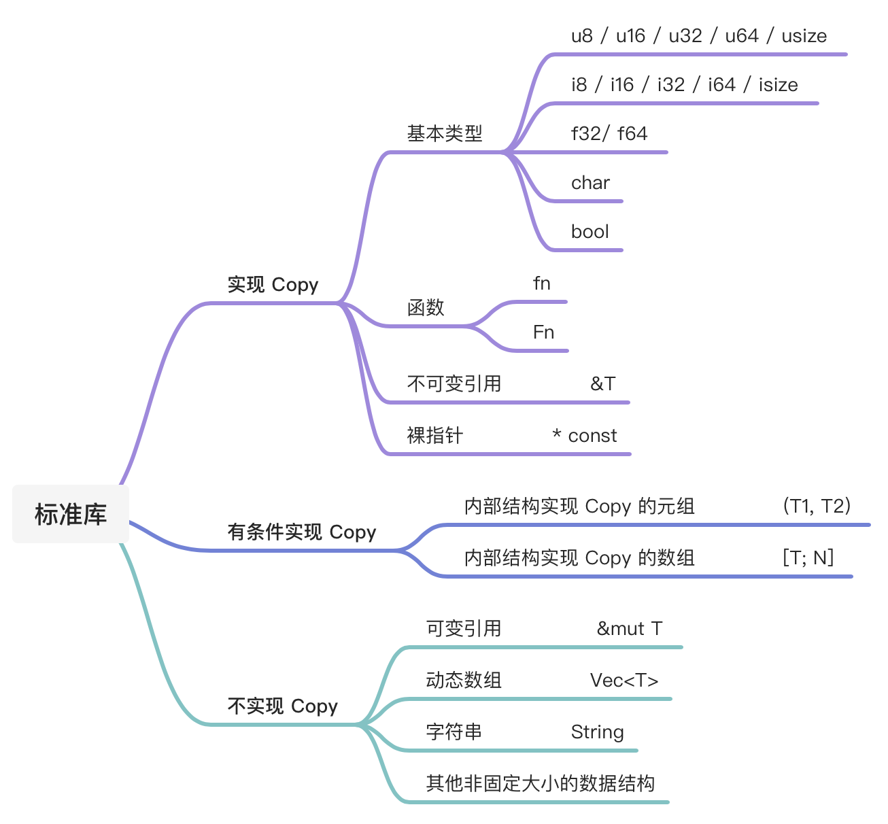

# `Copy` trait

```rust
pub trait Copy: Clone { }
```

`Copy` trait 没有任何额外的方法，它只是一个标记 trait。表示值可以进行简单的按位拷贝，该操作也称为浅拷贝。

虽然 `Copy` 没有任何行为，但它可以用作类型约束来进行类型安全检查。

如果某个类型实现了 `Copy` trait，该类型会由默认的 Move 语义转换为 Copy 语义，那么在赋值、函数调用的时候，值会被拷贝，原始值的所有权不会被转移。

## 如何实现 `Copy` trait

### 通过派生宏 `#[derive]` 自动实现

如果自定义结构体的所有字段类型都实现了 `Copy`，则可以用宏 `#[derive(Copy, Clone)]` 来为结构体实现 `Copy`：

```rust
#[derive(Copy, Clone)]
struct Student {
    age: u8,
    gender: u8,
}

fn main() {
    let s1 = Student {
        age: 8,
        gender: 1,
    };

    println!("{} {}", s1.age, s1.gender);
  
    let s2 = s1;  // copy 语义

    println!("{} {}", s1.age, s1.gender); // s1的所有权还在 
}
```

上面的实例代码是可运行的，因为 `u8` 类型实现了 `Copy`, 而下面所示的代码就会出错，因为 `String` 类型没有实现 `Copy`:

```rust
// ⚠️
#[derive(Copy, Clone)]
struct Teacher {
    name: String,
    age: u8,
}
```

### 通过 `impl` 手动实现

看上面的定义，`Copy` 继承于 `Clone`，如果要实现 `Copy` 的话，必须实现 `Clone`，然后实现一个空的 `Copy`。

```rust
struct MyStruct;

impl Copy for MyStruct {}

impl Clone for MyStruct {
    fn clone(&self) -> MyStruct {
        *self
    }
}
```

## 标准库中实现 `Copy` 的常用类型

* 原生类型，包括函数、不可变引用和裸指针实现了 `Copy`
* 数组和元组，如果其内部的类型实现了 `Copy`，那么他们也实现了 `Copy`
* 可变引用没有实现 `Copy`
* 非固定大小的数据结构，没有实现 `Copy`



## `Copy` trait 的底层实现

todo 从寄存器和栈的角度来分析 、  x86汇编 MOV指令 -》 引申出 栈上数据才可copy

## 为何不可变引用 `&T` 实现了 `Copy`，而可变引用 `&mut T` 没有实现 `Copy`？

Rust 的所有权规则规定：**同一时刻，在同一作用域下，只能拥有要嘛一个可变引用，要嘛任意多个不可变引用。**

因为可以存在任意多个不可变引用，所以不可变引用 `&T` 可以实现 `Copy`，传参、赋值时进行引用复制；

相反地，如果可变引用 `&mut T` 实现了 `Copy`，那么生成一个可变引用，然后把它复制给另一个变量时，就会违背 Rust 的所有权规则：**同一个作用域下只能有一个可变引用**。

# `Clone` trait

# `Copy` 和 `Clone` 的不同点
